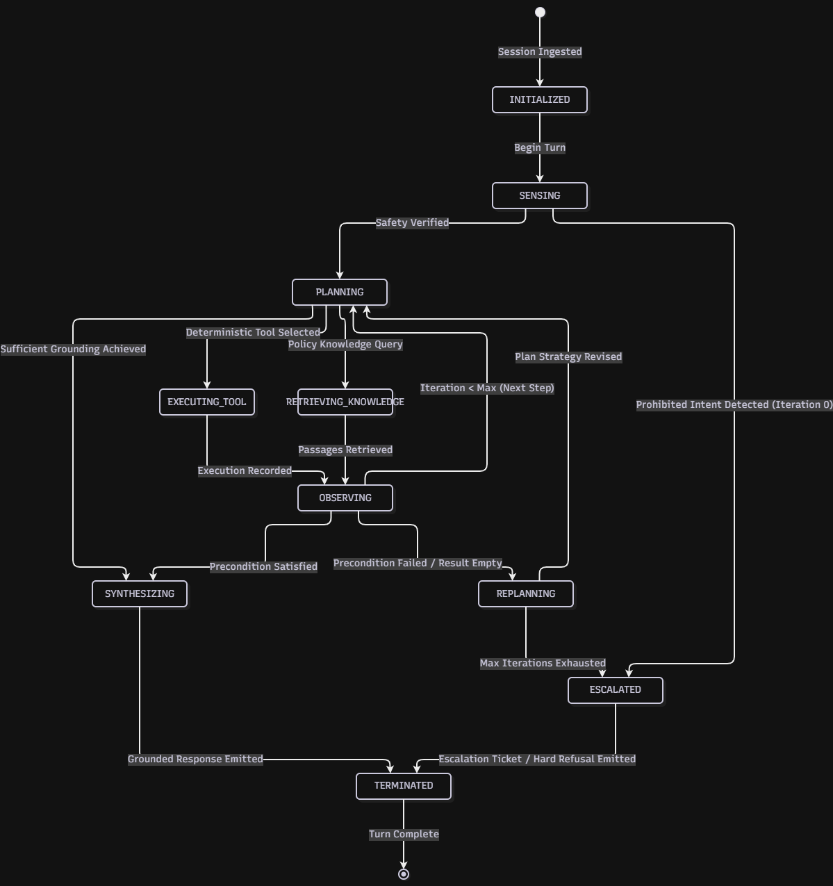

# State Machine Diagram

**System:** AI-Native University Student-Support Case Agent
**Module:** Agent Workflow & Session State Machine Specification

## 1. Architectural Scope & Design Principles

In compliance with explicit workflow state modeling principles, the Student Support Case Agent models execution state as a deterministic Finite State Machine (FSM).

State is decoupled from runtime loop variables and modeled as an immutable, serializable snapshot (`AgentWorkflowState`). This guarantees:

1. **Full Observability & Auditability:** Every state transition emits a typed telemetry event with complete context.
2. **Deterministic Fast-Fail & Boundary Enforcement:** Critical transitions (such as tool dispatch or administrative actions) require validated preconditions; invalid transitions raise explicit runtime errors.
3. **Recovery & Bounded Iteration:** Multi-step replanning is explicitly bounded by $N \le 3$ iterations before forcing an escalation or final synthesis state.

---

## 2. Finite State Machine Diagram



---

## 3. Workflow Phase Enums

The lifecycle of each turn progresses through discrete, typed phases:

| Phase            | Category         | Description                                                                      | Permitted Next Phases                    |
| :--------------- | :--------------- | :------------------------------------------------------------------------------- | :--------------------------------------- |
| `INITIALIZED`    | Setup            | Session instantiated, memory buffer loaded, and telemetry initialized.           | `SENSING`                                |
| `SENSING`        | Intake & Safety  | Evaluates user input against Iteration-0 deterministic safety guardrails.        | `PLANNING`, `ESCALATED`                  |
| `PLANNING`       | Strategy         | Selects deterministic tool actions, policy retrievals, or terminal synthesis.    | `EXECUTING_TOOL`, `SYNTHESIZING`         |
| `EXECUTING_TOOL` | Action           | Dispatches tools (`get_course_schedule`, `retriever`, `create_support_ticket`).  | `OBSERVING`                              |
| `OBSERVING`      | Assessment       | Assesses intermediate execution results, schemas, and error states.              | `PLANNING`, `REPLANNING`, `SYNTHESIZING` |
| `REPLANNING`     | Recovery         | Formulates an alternative strategy when a tool returns an error or empty result. | `PLANNING`, `ESCALATED`                  |
| `SYNTHESIZING`   | Output           | Compiles a grounded final response citing verified university sources.           | `TERMINATED`                             |
| `ESCALATED`      | Terminal (Guard) | Emits an administrative refusal or support escalation ticket.                    | `TERMINATED`                             |
| `TERMINATED`     | Final            | State committed to session memory; turn metrics recorded to telemetry.           | _None_                                   |

---

## 4. State Snapshot Schema

At any point during execution, the agent's complete state is represented by the following typed schema:

| Field Name                  | Type                   | Constraints / Allowed Values                                         | Description                                                                  |
| :-------------------------- | :--------------------- | :------------------------------------------------------------------- | :--------------------------------------------------------------------------- |
| `session_id`                | `str`                  | Non-empty string                                                     | Unique session identifier mapping to the conversation container.             |
| `student_id`                | `str`                  | Format: `^\d{10}$`                                                   | Verified institutional student identifier (e.g., `"2300712345"`).            |
| `turn_index`                | `int`                  | $\ge 1$                                                              | Sequential counter tracking dialogue turns within the session.               |
| `iteration_count`           | `int`                  | $0 \le i \le 3$                                                      | Current iteration within the bounded reasoning loop.                         |
| `active_goal`               | `Optional[str]`        | Max 256 characters                                                   | The specific intent currently being resolved by the planner.                 |
| `intermediate_observations` | `List[Dict[str, Any]]` | List of observation records                                          | Structured history of intermediate tool results and latencies for this turn. |
| `context_snippets`          | `List[Dict[str, Any]]` | List of passage records                                              | Grounded knowledge passages retrieved from policy vector stores.             |
| `status`                    | `str`                  | `"running"`, `"success"`, `"refused"`, `"tool_error"`, `"escalated"` | High-level status flag defining current execution condition.                 |

### JSON Schema Instance Example

```json
{
  "session_id": "session-live-01",
  "student_id": "2300712345",
  "turn_index": 1,
  "iteration_count": 1,
  "active_goal": "Resolve course timetable for BSE4104",
  "intermediate_observations": [
    {
      "step": 1,
      "action": "get_course_schedule",
      "status": "ok",
      "latency_ms": 38.5
    }
  ],
  "context_snippets": [],
  "status": "running"
}
```

---

## 5. Validation Invariants & Guardrail Rules

1. **Iteration-0 Deterministic Safety Gate:** A transition from `SENSING` to `PLANNING` is strictly forbidden if prohibited intent keywords (grade, mark, fee, or disciplinary alterations) match. The state machine MUST transition directly to `ESCALATED` with zero token leakage.
2. **Bounded Iteration Ceiling ($N \le 3$):** If `iteration_count >= 3` during `OBSERVING` or `REPLANNING`, further tool dispatch transitions (`EXECUTING_TOOL`) are prohibited. The orchestrator must transition directly to `ESCALATED` or `SYNTHESIZING`.
3. **Explicit Precondition Enforcement:** Transitions into state-modifying actions (such as `create_support_ticket`) require `student_confirmed == true`. Missing parameters must yield structured errors caught during `OBSERVING`, triggering `REPLANNING`.
4. **State Immutability & Auditability:** State snapshots are immutable historical records. All updates produce a newly incremented snapshot record for downstream telemetry inspection.
