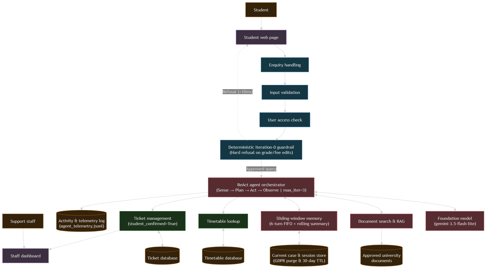

# Updated System Architecture Diagram

**System:** AI-Native University Student-Support Case Agent
**Module:** System Architecture, Stateful Memory & Bounded Orchestration

---

## High-Level System Architecture

---

## Layer Breakdown

* **Users Layer:** Primary users (Students submitting academic, timetable, and policy inquiries) and Secondary users (Academic & Support staff managing complex case escalations).
* **User Interface Layer:** Dedicated client entry points comprising the student conversational interface and the staff ticket escalation dashboard.
* **Application & Guardrail Layer (Deterministic Controls):** Intake enquiry handling, strict schema validation, institutional ID verification, and deterministic Iteration-0 safety guardrails intercepting prohibited actions (grade or fee alterations) in **$<10\text{ms}$** with zero token leakage.
* **AI & Orchestration Layer:** Houses the bounded ReAct orchestrator loop (**$\text{Sense} \rightarrow \text{Plan} \rightarrow \text{Act} \rightarrow \text{Observe} \rightarrow \text{Re-Plan}$**, capped at **$\text{max\_iterations}=3$**), foundation model reasoning (`gemini-3.5-flash-lite`), hybrid RAG semantic document search, and a 6-turn FIFO sliding-window memory manager with deterministic rolling summarization.
* **Tools Layer:** Strictly typed, schema-validated execution handlers providing read access to lecture schedules (`timetable_tool.py`) and simulated side-effect administrative case creation (`ticket_tool.py`, gated by explicit student confirmation).
* **Data & Observability Layer:** Backing persistence stores for activity and runtime telemetry logs (`agent_telemetry.jsonl` tracking token saturation and decoupled latencies), active session state with GDPR hard-purge and 30-day TTL expiration, approved university policy documents, institutional timetable databases, and persistent ticket records (`tickets.json`).
